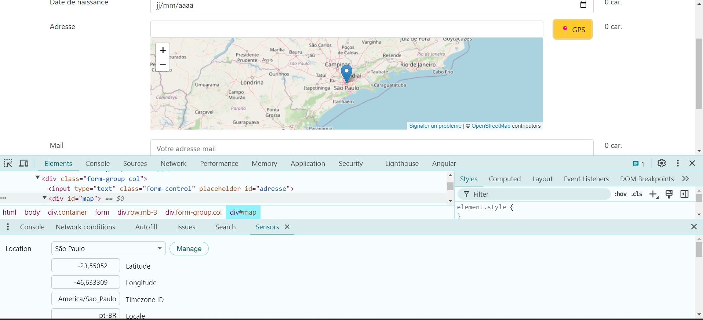
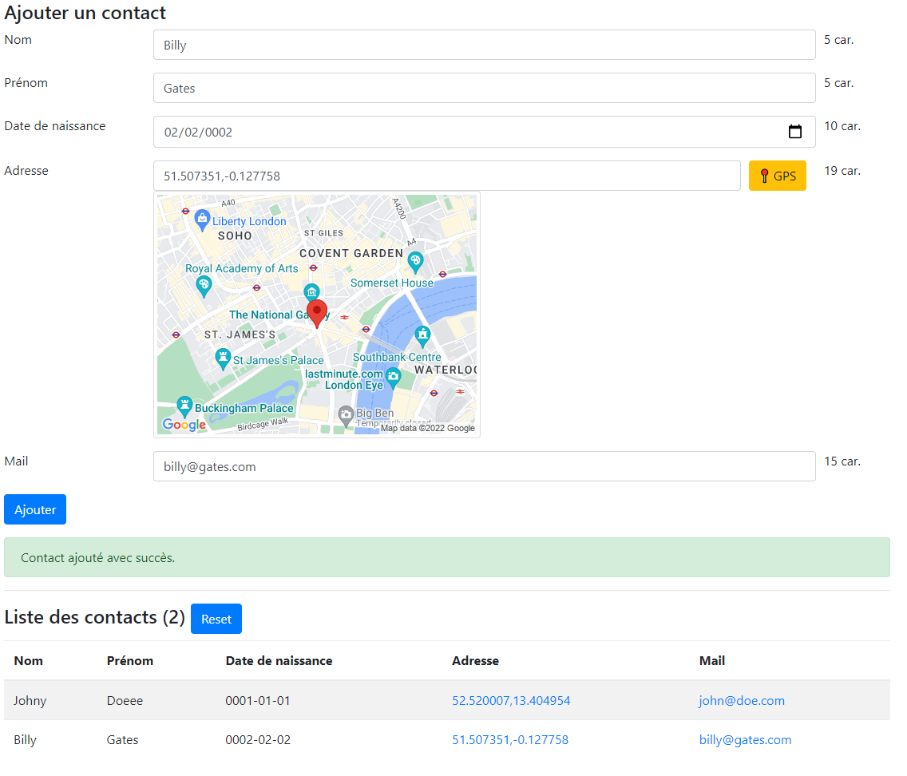

<p align="center">
      
  <br/>
<h3 align="center">TP AW #4 : 
Ajout de fonctionnalités HTML5 au formulaire
</h3>
</p>

### Prérequis (⚠️ important)

- Lire **tout** l'énoncé avant de commencer le TP.

❓❓Si vous avez des questions ou des erreurs dans votre code :

- formater (indenter) bien votre code (raccourci Visual Studio Code : Ctrl + K puis Ctrl + F)
- demander à Google 🔍
- demander à vos camarades 👩‍🎓👨‍🎓
- demander au professeur 🙋

# Table des matières

- [Table des matières](#table-des-matières)
  - [1. Objectif du TP](#1-objectif-du-tp)
  - [2. Plateforme de dév (idem que le TP3)](#2-plateforme-de-dév-idem-que-le-tp3)
  - [3. Geolocalisation HTML5](#3-geolocalisation-html5)
    - [1. JavaScript **gps.js**](#1-javascript-gpsjs)
    - [2. Ajouter un bouton à coté du champ de saisie de l’adresse](#2-ajouter-un-bouton-à-coté-du-champ-de-saisie-de-ladresse)
    - [3. Mapping du bouton HTML et de la fonction javaScript](#3-mapping-du-bouton-html-et-de-la-fonction-javascript)
    - [4. 💡 Simuler d'autres coordonées GPS depuis l'outil de dev. de Chrome](#4--simuler-dautres-coordonées-gps-depuis-loutil-de-dev-de-chrome)
  - [4. Afficher le nombre de caractère saisie](#4-afficher-le-nombre-de-caractère-saisie)
  - [5. Ajouter le contact à un tableau JSON (store.js)](#5-ajouter-le-contact-à-un-tableau-json-storejs)
  - [6. Afficher la liste des contacts dans un tableau HTML](#6-afficher-la-liste-des-contacts-dans-un-tableau-html)

## 1. Objectif du TP

- HTML5: Commencer à utiliser les capacités avancées (géolocalisation)
- JS : écrire un code modulaire (
  - Article à ce sujet: https://medium.freecodecamp.org/javascript-modules-a-beginner-s-guide-783f7d7a5fcc
- JS : Manipuler des objets JSON
  - voir documentation sur https://www.w3schools.com/js/js_json_intro.asp
- Afficher une map dans une [iframe](https://developer.mozilla.org/fr/docs/Web/HTML/Reference/Elements/iframe) centrée sur les coodonnées GPS de l'utilsateur : https://www.openstreetmap.org/export/embed.html?bbox=-1.7277580000000001%2C49.907351%2C1.472242%2C53.107351&layer=mapnik&marker=51.507351%2C-0.127758

Reprenez le formulaire et les règles de validationdu [TP 3](../tp3/) :

- Nom (5 caractères mininum)
- Prénom (5 caractères mininum)
- Date de naissance (ne peut pas être dans le futur)
- Adresse postale (5 caractères mininum)
- Adresse mail (doit être bien formaté)


## 2. Plateforme de dév (idem que le TP3)

Votre répertoire doit ressembler à ça:

```
tp3/
├── index.html
├── css/
│   ├── bootstrap.css
└── js/
    ├── bootstrap.bundle.js
    └── form-validation.js
```

## 3. Geolocalisation HTML5

- L'API Géolocalisation HTML5 est utilisée pour obtenir la position géographique d'un utilisateur (si il utilise un navigateur récent)
- Documentation et fonction JS de géolocalisation disponibles ici : https://www.w3schools.com/html/html5_geolocation.asp

### 1. JavaScript **gps.js**

Dans un fichier **gps.js**, copier le code ci-dessous:

```javascript
// demande de la localisation à l'utilisateur
function getLocation() {
  if (navigator.geolocation) {
    navigator.geolocation.getCurrentPosition(showPosition, showError);
  } else {
    document.querySelector("#map").innerHTML =
      "Geolocation is not supported by this browser.";
  }
}

// Si l"utilisateur l'autorise, on récupère les coordonnées dans l'objet "position"
function showPosition(position) {
  // paramètres pour l'affichage de la carte openstreetmap
  // Définir un facteur d’échelle selon le zoom (plus zoomé → bbox plus petite)
  const zoom = 5;
  const delta = 0.05 / Math.pow(2, zoom - 10);

  const bboxEdges = {
    south: position.coords.latitude - delta,
    north: position.coords.latitude + delta,
    west: position.coords.longitude - delta,
    east: position.coords.longitude + delta,
  };

  const bbox = `${bboxEdges.west}%2C${bboxEdges.south}%2C${bboxEdges.east}%2C${bboxEdges.north}`;
  const iframeSrc = `https://www.openstreetmap.org/export/embed.html?bbox=${bbox}&layer=mapnik&marker=${position.coords.latitude}%2C${position.coords.longitude}`;

  // Injecter l'iframe
  document.getElementById("map").innerHTML = `
        <iframe
          width="100%"
          height="200"
          frameborder="0"
          scrolling="no"
          src="${iframeSrc}" >
        </iframe>
      `;
}

// Au cas ou l'utilisateur refuse
// Ou si une erreur arrive
function showError(error) {
  switch (error.code) {
    case error.PERMISSION_DENIED:
      document.querySelector("#map").innerHTML =
        "User denied the request for Geolocation.";
      break;
    case error.POSITION_UNAVAILABLE:
      document.querySelector("#map").innerHTML =
        "Location information is unavailable.";
      break;
    case error.TIMEOUT:
      document.querySelector("#map").innerHTML =
        "The request to get user location timed out.";
      break;
    case error.UNKNOWN_ERROR:
      document.querySelector("#map").innerHTML = "An unknown error occurred.";
      break;
  }
}
```

### 2. Ajouter un bouton à coté du champ de saisie de l’adresse

### 3. Mapping du bouton HTML et de la fonction javaScript

Dans votre script **form-validation.js** intercepter le click sur ce bouton et utiliser la fonction getLocation() pour demander la géolocalisation à l’utilisateur

La géolocalisation vous donnera la **latitude** et la **longitude** de l’utilisateur.

Afficher une map (dans le code JS ci-dessus ça s'affiche dans une DIV avec id="map") OpenstreetMap centrée sur ces coordonnées GPS (documentation de l’API google maps)

URL de la map à afficher dans une [iframe](https://developer.mozilla.org/fr/docs/Web/HTML/Reference/Elements/iframe) (exemple pour Londres) : https://www.openstreetmap.org/export/embed.html?bbox=-1.7277580000000001%2C49.907351%2C1.472242%2C53.107351&layer=mapnik&marker=51.507351%2C-0.127758
Post détaillant son fonctionnement: https://simonwillison.net/2024/Nov/25/openstreetmap-embed-url/

### 4. 💡 Simuler d'autres coordonées GPS depuis l'outil de dev. de Chrome

Dans l'outil de developpement de Google Chrome, il est possible de surcharger la localisation de l'utilisateur.

Pour ce faire :

- Aller dans l'outil de dévelopmment : touche **F12** ou **⁝**(Menu de Chrome)/**Plus d'outils**/**Outils de developpement**
- Cliquez sur les "**...**", choisir **More Tools** puis **Sensors**
- 
- Vous aurez accés à l'onglet "Sensors", dans la section **Location**, vous pourrez choisir l'une des villes préselectionnée (par exemple **sao paulo**)
- 
- Cliquez sur le bouton "GPS" de votre page web pour actualiser et vérifier les coordonnées lat/lon et l'image Google Maps de votre formulaire.

## 4. Afficher le nombre de caractère saisie


A coté de chaque champ de saisie, afficher le nombre de caractère saisie en temps réel, c’est-à-dire à chaque fois que l’utilisateur change le contenu du champ.
Pour intercepter l'appui sur le clavier de l'utilsateur, on peut intercepter l'un des ces 3 évévements (**à vous de voir lequel est le plus efficace**)

- onkeydown https://www.w3schools.com/jsref/event_onkeydown.asp
- onkeypress https://www.w3schools.com/jsref/event_onkeypress.asp
- onkeyup https://www.w3schools.com/jsref/event_onkeyup.asp

Exemple de code avec onkeypress.
Le nombre de caractère sera affiché dans une balise `span` que l'on positionne juste aprés la balise `input`.
On pourra la cibler en CSS et JS, grâce à un selecteur
**combinateur de voisin direct** (https://developer.mozilla.org/fr/docs/Web/CSS/Adjacent_sibling_combinator)

<div  align="center">Extrait de code HTML</div>

```html
<form>
  <div class="row mb-3">
    <div class="form-group col-2">
      <label for="name">Nom</label>
    </div>
    <div class="form-group col">
      <input
        type="text"
        class="form-control"
        placeholder=""
        id="name"
        autofocus
        onkeyup="calcNbChar(this.id)"
      />
    </div>
    <div class="form-group col-1" data-count>0 car.</div>
  </div>
</form>
```

<div  align="center">Extrait de code JS</div>

```js
function calcNbChar(id) {
  const countElement = document
    .querySelector(`#${id}`)
    .parentElement.parentElement.querySelector("[data-count]");
  // on cherche le champ de saisie avec l'identifiant donné en paramêtre,
  // puis on remonte de 2 noeuds au dessus pour trouver ensuite
  // l'élément qui a l'attribut data-count

  countElement.textContent =
    document.querySelector(`#${id}`).value.length + " car.";
}
```

<!---
## 5. Stockage du formulaire dans le LocalStorage du navigateur


1. Au click sur le bouton “Valider” du formulaire, enregistrer les valeurs de tous les champs de saisie dans le localStorage du navigateur
2. Afficher un message “Bravo! Le formulaire est sauvegardé.” à l’utilisateur.

HTML Local storage permet de stocker des données dans le navigateur web (comme les cookies) via une combinaison clé:valeur (key:value)
Exemple

* Pour stocker la valeur “smith” dans la clé “lastname” :
```js
localStorage.setItem("lastname", "Smith");
```
* Pour lire la valeur de la clé  :
```js
var prenom = localStorage.getItem("lastname");
```

* Documentation : http://www.w3schools.com/html/html5_webstorage.asp
-->

## 5. Ajouter le contact à un tableau JSON (store.js)

1. créer un fichier **store.js**

   - Ce script stockera le contact dans une liste JSON
   - Cette liste sera sauvegardé dans une base de données local (localStorage https://developer.mozilla.org/fr/docs/Web/API/Window/localStorage)
   - Les méthodes disponibles seront:
     - Ajout d'un contact à la liste **contactStore.add(\_name, \_firsname, \_date, \_adress, \_mail);**
     - Listing des contacts **contactStore.getList();**
     - Remise à zéro de la liste **contactStore.reset();**

- Code à reprendre:

```js
/*
store.js
Script pour gérer la liste de contact en JSON

Pour ajouter un contact:  contactStore.add(_name, _firsname, _date, _adress, _mail);
Pour récuper la liste:    contactStore.getList();
*/
var contactStore = (function () {
  // variable privée
  let contactListString = localStorage.getItem("contactList");
  var contactList = contactListString ? JSON.parse(contactListString) : [];

  // Expose these functions via an interface while hiding
  // the implementation of the module within the function() block

  return {
    add: function (_name, _firsname, _date, _adress, _mail) {
      var contact = {
        name: _name,
        firstname: _firsname,
        date: _date,
        adress: _adress,
        mail: _mail,
      };
      // ajout du contact à la liste
      contactList.push(contact);

      // persistence de la liste dans une base de données local du navigateur web
      // https://developer.mozilla.org/fr/docs/Web/API/Window/localStorage
      localStorage.setItem("contactList", JSON.stringify(contactList));

      return contactList;
    },
    reset: function () {
      localStorage.removeItem("contactList");

      return contactList;
    },

    getList: function () {
      return contactList;
    },
  };
})();
```

2. Si le formulaire est valide, appeler la méthode qui ajoute toutes les informations au tableau JSON

## 6. Afficher la liste des contacts dans un tableau HTML



- Créer une fonction pour afficher les contacts sous forme de tableau HTML:

```js
function displayContactList() {
  const contactListString = localStorage.getItem("contactList"); // ici on va récupérer la liste en forme de chaine de caractère (string)
  const contactList = contactListString ? JSON.parse(contactListString) : [];
  document.querySelector("table tbody").innerHTML = "";
  for (const contact of contactList) {
    document.querySelector("table tbody").innerHTML += `<tr>
  <td>${contact.name}</td>
  <td> ${contact.firstname} </td>
  <td>${contact.date}</td>
  <td> ${contact.adress} </td>
  <td>${contact.mail}</td> 
  <!-- CODE à compléter pour mettre en forme les données (lien vers google maps, mail cliquable) -->
  <tr>
  `;
  }
}
```

- Appeler la fonction displayContactList() au chargement de la page
  De cette façon, la liste des contacts (sauvegardé dans le localStore) sera affiché.

```js
window.onload = function () {
  // ce code est exécuter une fois que toute la page est téléchargée par le navigateur
  // voir plus : https://www.w3schools.com/js/js_htmldom.asp
  console.log("DOM ready!");
  displayContactList();

  document.querySelector("form").addEventListener("submit", function (event) {
    event.preventDefault();
    console.log("form submitted!");
    contactStore.add(
      document.querySelector(`#name`).value,
      document.querySelector(`#firstname`).value,
      document.querySelector(`#birth`).value,
      document.querySelector(`#adresse`).value,
      document.querySelector(`#mail`).value
    );
    displayContactList();
  });

  document.querySelector("#gps").addEventListener("click", function (event) {
    event.preventDefault();
    getLocation();
  });
};
```

- à coté du bouton "Ajouter", ajouter un bouton **Reset** qui va appeler la fonction `contactStore.reset()`
